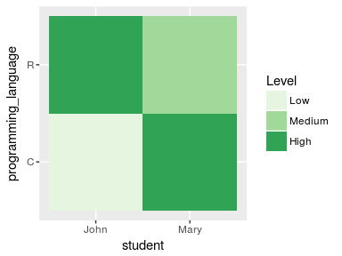

Overview of the basics and underlying structure of the `R` graphical package `ggplot2` [@Wickham2010].

This document is written in an `R Markdown` and allows `R` code chunks to be interleaved with `Markdown` formatted text (more info about [`R Markdown`](http://rmarkdown.rstudio.com), and about [`Markdown`](http://rmarkdown.rstudio.com/authoring_pandoc_markdown.htm)).


Components of `ggplot2` 
=======================

The syntax of `ggplot2` is based on _The Grammar of Graphics_ [@Wilkinson2010], and each plot can be obtained by a series of _specifications_, that are given as _layers_. Let's have a quick look to the different parts. [Full reference](http://ggplot2.tidyverse.org/reference/index.html).


```r
# install.packages("ggplot2") # If needed, install ggplot2
library(ggplot2) # Load the package
```


Tidy data set
-------------

First of all, `ggplot2` expects a tidy data frame as input. The format needs to be in a long layout (opposed to a wide layout). Long data has one observation per row and one variable per column:

Student | Programming language | Knowledge
--------|----------------------|-----------
John    | R                    | 3 High
John    | C                    | 1 Low
Mary    | R                    | 2 Medium
Mary    | C                    | 3 High


The same information in a wide layout (not suitable for `ggplot2`) would be:

Student | R        | C        
--------|----------|-------
John    | 3 High   | 1 Low
Mary    | 2 Medium | 3 High


We will use a simple data frame with these data to test `ggplot2` commands. Later, we will use a real-life (although tidy) data set in the [examples](#expression).


```r
programming_level <- data.frame(
    student = c("John", "John", "Mary", "Mary"),
    programming_language = c("R", "C", "R", "C"),
    knowledge = c(3, 1, 2, 3)
    )
```

Plot calls start with `ggplot(data = <data>)` and then extra specifications are added using the sign `+`.


Geoms and aesthetic mapping to variables
----------------------------------------

The main layers tell `ggplot` what variables from the data to represent and how are they going to be represented.

We typically add a layer with a `geom_*()` function. There are geoms (geometric objects) to represent common graphs such as points, lines, bars, polygons or text. Each geom has a set of aesthetic attributes (x position, y position, colour, shape...) that can be mapped to variables in our data through the function parameter `mapping`, using the function `aes()`.


```r
# Scatterplot
ggplot(data = programming_level) +
    geom_point(mapping = aes(x = student, y = knowledge, shape = programming_language))

# Heatmap
ggplot(data = programming_level) +
    geom_tile(mapping = aes(x = student, y = programming_language, fill = knowledge))
```


Aesthetics can also be modified for all observations by calling them outside of the `aes()` function.


```r
# Scatterplot
ggplot(data = programming_level) +
    geom_point(mapping = aes(x = student, y = knowledge, shape = programming_language), alpha = 0.5, size = 5)

# Heatmap
ggplot(data = programming_level) +
    geom_tile(mapping = aes(x = student, y = programming_language, fill = knowledge), colour = "white", size = 5)
```


Type `?geom_*` (function help) in order to know what aesthetics the geom can take.


Stats and position adjustment
-----------------------------

Statistical transformations of the variables (e.g. represent counts of each value) and the adjustment of the position can also be specified in the geom function with the parameters `stat` and `position`. Alternatively we can use `geom_*()` functions for common representations that have already the required transformations and position adjustments as defaults.

For example, to make a histogram we can change the statistical transformation and the position of `geom_bar()` or we can use the function `geom_histogram()`, that has the right defaults for `stat` and `position`.


```r
# geom_bar
ggplot(data = programming_level) +
    geom_bar(aes(x = knowledge), stat = "bin", position = "stack")

# genom_histogram
ggplot(data = programming_level) +
    geom_histogram(aes(x = knowledge))
```


Basic position values:  

* identity: Don't adjust position
* stack: Stack overlapping objects on top of each another
* dodge: Dodge overlapping objects side-to-side
* nudge: Nudge points a fixed distance
* jitter: Jitter points to avoid overplotting


Scales
------

The values taken by the aesthetics mapped to variables can be controlled by another set of functions called `scale_<aesthetic>_<name>`. [All available scales](http://ggplot2.tidyverse.org/reference/index.html#section-scales)


```r
# Scatterplot
ggplot(data = programming_level) +
    geom_point(mapping = aes(x = student, y = knowledge, shape = programming_language)) + 
    scale_shape_manual(values = c(3, 8))+
    scale_y_continuous(breaks = c(1, 2, 3), labels = c("Low", "Medium", "High"), name = "Programming level")

# Heatmap
ggplot(data = programming_level) +
    geom_tile(mapping = aes(x = student, y = programming_language, fill = as.factor(knowledge))) +
    scale_fill_brewer(type = "seq", palette = "Greens", name  = "Level", labels = c("Low", "Medium", "High"))
```



There are some helper functions for common tasks.

* `labs()`: set axes titles, plot title, subtitle...
* `lims()`: set axis limits


```r
# Scatterplot
ggplot(data = programming_level) +
    geom_point(mapping = aes(x = student, y = knowledge, shape = programming_language)) + 
    scale_shape_manual(values = c(3, 8))+
    scale_y_continuous(breaks = c(1, 2, 3), labels = c("Low", "Medium", "High"), name = "Programming level") +
    labs(shape = "Language", title = "Programming knowledge", x = "Student name")

# Heatmap
ggplot(data = programming_level) +
    geom_tile(mapping = aes(x = student, y = programming_language, fill = as.factor(knowledge))) +
    scale_fill_brewer(type = "seq", palette = "Greens", name  = "Level", labels = c("Low", "Medium", "High")) +
    labs(y = "Programming language", title = "Programming knowledge")
```


Coordinates
-----------

There are two coordinates systems available:

* Cartesian, the default. Some `coord_*()` functions can modify the system slightly (e.g. swap axes with `coord_flip()`).
* Polar, using the function `coord_polar()`.


```r
# Scatterplot
ggplot(data = programming_level) +
    geom_point(mapping = aes(x = student, y = knowledge, shape = programming_language)) + 
    scale_shape_manual(values = c(3, 8)) +
    scale_y_continuous(breaks = c(1, 2, 3), labels = c("Low", "Medium", "High"), name = "Programming level") +
    labs(shape = "Language", title = "Programming knowledge", x = "Student name") +
    coord_polar()

# Heatmap
ggplot(data = programming_level) +
    geom_tile(mapping = aes(x = student, y = programming_language, fill = as.factor(knowledge))) +
    scale_fill_brewer(type = "seq", palette = "Greens", name  = "Level", labels = c("Low", "Medium", "High")) +
    labs(y = "Programming language", title = "Programming knowledge") +
    coord_polar()
```


Facets
------

We can also create a set of subplots using variables from the data. It is especially useful when representing many variables. There are two functions available `facet_grid()` and `facet_wrap()`.


```r
ggplot(data = programming_level) +
    geom_bar(mapping = aes(x = student, y = knowledge), stat = "identity") + 
    scale_y_continuous(breaks = c(1, 2, 3), labels = c("Low", "Medium", "High"), name = "Programming level") +
    labs(title = "Programming knowledge", x = "Student name") +
    facet_grid(.~programming_language)
```

<!-- -->


Themes
------

Themes control how the elements of the plot are represented (excluding the data themselves). The default theme can be substituted by another (e.g. `theme_classic()`) or individual elements of the theme can be modified with the function `theme()` (`?theme` for the list of plot elements).


```r
# Scatterplot
ggplot(data = programming_level) +
    geom_point(mapping = aes(x = student, y = knowledge, shape = programming_language)) + 
    scale_shape_manual(values = c(3, 8)) +
    scale_y_continuous(breaks = c(1, 2, 3), labels = c("Low", "Medium", "High"), name = "Programming level") +
    labs(shape = "Language", title = "Programming knowledge", x = "Student name") +
    theme_classic(base_size = 16)

# Heatmap
ggplot(data = programming_level) +
    geom_tile(mapping = aes(x = student, y = programming_language, fill = as.factor(knowledge))) +
    scale_fill_brewer(type = "seq", palette = "Greens", name  = "Level", labels = c("Low", "Medium", "High")) +
    labs(y = "Programming language", title = "Programming knowledge") + 
    theme(legend.position = "left")
```


Real-life example gene expression {#expression}
==========================

Data set
--------
Human gene expression from [GTEx Project](https://gtexportal.org/home/). We have a table with the median gene expression values in TMP for 8 selected tissues and 54225 genes. There are also other details about the tissue and the genes.


```r
expression_data<-read.table(file = "data/expression_data.txt", header = TRUE, sep = "\t", stringsAsFactors = FALSE)

# If too big, load a 5000-gene table
# expression_data<-read.table(file = "data/expression_data_tiny.txt", header = TRUE, sep = "\t", stringsAsFactors = FALSE)
```

Data set structure (variables, variable types, values...).


```r
str(expression_data)
```

```
## 'data.frame':	433800 obs. of  12 variables:
##  $ gene_id          : chr  "ENSG00000000003.10" "ENSG00000000003.10" "ENSG00000000003.10" "ENSG00000000003.10" ...
##  $ gene_name        : chr  "TSPAN6" "TSPAN6" "TSPAN6" "TSPAN6" ...
##  $ tissue           : chr  "Brain" "Liver" "Muscle" "Testis" ...
##  $ median_expression: num  5.86 30.78 2.59 97.09 39.71 ...
##  $ tissue_type      : chr  "Brain" "Liver" "Muscle" "Testis" ...
##  $ gene_chr         : chr  "X" "X" "X" "X" ...
##  $ gene_annotation  : chr  "HAVANA" "HAVANA" "HAVANA" "HAVANA" ...
##  $ gene_start       : int  99883667 99883667 99883667 99883667 99883667 99883667 99883667 99883667 99839799 99839799 ...
##  $ gene_end         : int  99894988 99894988 99894988 99894988 99894988 99894988 99894988 99894988 99854882 99854882 ...
##  $ gene_strand      : chr  "-" "-" "-" "-" ...
##  $ gene_type        : chr  "protein_coding" "protein_coding" "protein_coding" "protein_coding" ...
##  $ gene_status      : chr  "KNOWN" "KNOWN" "KNOWN" "KNOWN" ...
```

The data frame is already in a long format (each gene appears 8 times, 1 for tissue).

Types of genes
--------------
There are different types of genes in the data set. Which are the most abundant types?
Represent the abundance of each of them in a bar plot.


```r
# We can subset the data frame and use only one tissue, because all the eight tissues have the same genes.
expression_data_brain<-expression_data[expression_data$tissue %in% "Brain", ]

# Then we can just count how many genes of each type are in the data set
table(expression_data_brain$gene_type)
```

```
## 
##      antisense        lincRNA          miRNA       misc_RNA protein_coding 
##           4999           7033           2838           2010          19820 
##     pseudogene           rRNA         snoRNA          snRNA 
##          13705            520           1408           1892
```

```r
# To represent the abundance of each type we can use a geom_bar, that uses by default the "count" stat. 
```

Gene annotations come from two sources, Havana Project and Ensembl. Which gene types come from each source?
Map gene_annotation variable to fill, colour or alpha. You can customise the scale of the aesthetic with a `scale_*` function.


Number of expressed genes per tissue
------------------------------------
Each tissue may express a different number of genes. Which tissue expresses more genes?
Represent the proportions of genes expressed/not expressed in each tissue.

```r
# We can create an extra simple variable indicating if the gene is expressed or not as TRUE/FALSE
expression_data$expressed <- expression_data$median_expression > 0
```

The differences in abundance are the same for different types of genes?
You can use only the rows with expressed genes in the data set and represent the variables gene_type and tissue with different aesthetics.


Genes of interest
----------------
Choose a handful of genes and analyse their expression pattern. Examples: "HLA_B", "SOX2", "BRCA2".
You can use lines to link expression of the same gene in different tissues (you will need to specify that you want to group by gene).


```r
genes<-c("HLA-B","BFAR","C19orf48")
# We can create a smaller data frame with the selected genes
expression_genes<-expression_data[expression_data$gene_name %in% genes, ]
```


Genes highly expressed in brain
-------------------------------
Constitutive genes and genes with an important function in the brain may be highly expressed. Which are the most expressed genes in the brain?
You can represent chromosomes against expression.


```r
# To set the order of the chromosomes
expression_data_brain$gene_chr<-factor(expression_data_brain$gene_chr,levels=c(as.character(1:22),"X","Y","M"))
```

You can locate the position of the genes within the chromosome using `gene_start` together with `gene_chr` using facets, for instance.


Median expression per tissue and gene type
------------------------------------------
Create a plot showing the median expression (and possibly the distribution) for each type of gene in each of the 8 tissues. Edit scales, font sizes, theme, labels and legend to create a publication-quality graphic.


References
==========
